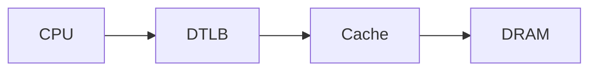

# Joel's Scratchpad

A self-contained Hugo site inspired by Enervoid's restrained, writing-first aesthetic. It is designed for technical writing: equations, code, Mermaid diagrams, figures, project case studies, and short engineering notes.

## 1. Local development

Install **Hugo 0.166.0 or newer** (the project uses Hugo’s current post-v0.146 template layout), then:

```bash
hugo server -D
```

Open `http://localhost:1313`.

The `-D` flag includes drafts. Production builds exclude them automatically.

## 2. Before deployment

Edit `hugo.toml` and replace:

```toml
baseURL = "https://YOUR_GITHUB_USERNAME.github.io/"
```

The included GitHub Pages workflow passes the deployment URL to Hugo automatically, so this placeholder mostly matters for local canonical/RSS previews.

Also edit the identity text under `[params]` if needed.

## 3. Add content

### Long-form article

```bash
hugo new content writing/my-article.md
```

### Short note

```bash
hugo new content notes/my-note.md
```

### Project

```bash
hugo new content projects/my-project.md
```

Drafts stay local until `draft = false` (or `draft: false` in YAML front matter).

## 4. Math

Inline math:

```markdown
The condition is \( owner(V) = currEID \).
```

Display math:

```markdown
$$
T = \operatorname{MAC}_K(A \parallel M)
$$
```

For automatic numbering and cross-references:

```markdown

T_i = \operatorname{MAC}_K(A_i \parallel M_i)


As shown in , ...
```

Equations are numbered in document order by a tiny client-side script.

## 5. Mermaid

Use a normal fenced block:

````markdown

````

The site loads Mermaid only on pages that contain Mermaid code fences.

## 6. Figures

```markdown

```

`width` may be `normal`, `wide`, or `full`.

## 7. Callouts

```markdown

The refill response is not architecturally visible until authentication completes.

```

Types: `note`, `important`, `warning`, `result`.

## 8. Code blocks

Normal fenced code gets syntax highlighting and a copy button automatically.

For a filename/header:

```text

...code...

```

## 9. Animated technical diagram

Insert the reusable pipeline demo:

```text

```

It has explicit **Play** and **Reset** controls; it never autoplays.

## 10. GitHub Pages

Push this repository to GitHub, then in the repository:

**Settings → Pages → Source → GitHub Actions**

The included `.github/workflows/hugo.yaml` follows Hugo's current GitHub Pages deployment approach.

## Content model

- `writing/` — polished long-form technical articles
- `notes/` — short debugging notes, observations, paper notes, implementation gotchas
- `projects/` — technical case studies
- `archive/` — combined chronological view of writing + notes

Projects are intentionally not in the top navigation; selected projects are exposed from the homepage.

## Homepage portrait

The homepage has a built-in 3:4 portrait slot. Until an image is configured it renders a restrained placeholder.

1. Put the image in `static/images/`, for example `static/images/joel.jpg`.
2. Set this in `hugo.toml`:

```toml
homeImage = "/images/joel.jpg"
homeImageAlt = "Portrait of Joel Dan Philip"
```

The template will switch from the placeholder to the image automatically.
