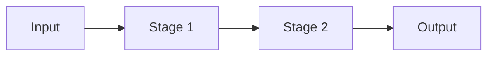

This page exists mainly as a **reference while you write**. Keep it, make it a draft later, or delete it once the site's conventions become familiar.

## Equations

Inline expressions use normal LaTeX delimiters, for example \(A_i\), \(M_i\), and \(K\). A display equation can be written directly:

$$
H(z) = \sum_{k=0}^{N-1} h_k z^{-k}
$$

When an equation should be numbered and referenced, use the `equation` shortcode:


y[n] = \sum_{k=0}^{N-1} h[k]x[n-k]


The text can then point back to  without hard-coding the number. Numbering follows document order.


Use ordinary display math when you do not need a number. Use the numbered shortcode only for equations you intend to reference.


## Mermaid diagrams

A fenced `mermaid` block is rendered as a monochrome diagram that matches the site.



Mermaid is ideal for diagrams that change frequently while you are writing. Final architecture figures can still be SVGs when you need exact placement.

## Code

Normal fenced code receives syntax highlighting and a copy button:

```systemverilog
always_ff @(posedge clk) begin
    if (rst) begin
        valid_out <= 1'b0;
    end else if (valid_in) begin
        valid_out <= 1'b1;
    end
end
```

A code block can also carry a filename:


assign ready_out = ready_in && !stall;
assign fire      = valid_in && ready_out;


## Figures

Figures support `normal`, `wide`, and `full` widths. Architecture diagrams should usually use `wide` so prose stays readable without constraining the drawing.



## Tables

Tables deliberately look closer to a paper than a dashboard.

| Configuration | Cycles | Miss rate | Notes |
| --- | ---: | ---: | --- |
| Baseline | 100,000 | 3.1% | reference |
| Variant A | 124,900 | 3.3% | first implementation |
| Variant B | 112,400 | 3.2% | optimized implementation |

## Callouts


State the invariant that readers should keep in mind while following the implementation.



Do not use callouts for every paragraph. They are intentionally visually quiet and should mark information that changes how the reader interprets the design.



A result box is useful for one conclusion after a benchmark or derivation.


## Controlled animation

Animations are content, not decoration. The reusable pipeline figure does **not** autoplay and exposes only Play and Reset.



This same pattern can later be adapted for a transaction, pipeline trace, FSM transition, or other step-by-step hardware behavior.

## Long articles

Long-form writing gets a sticky table of contents on the right at desktop widths. On smaller displays it moves above the article so the reading column remains comfortable.
